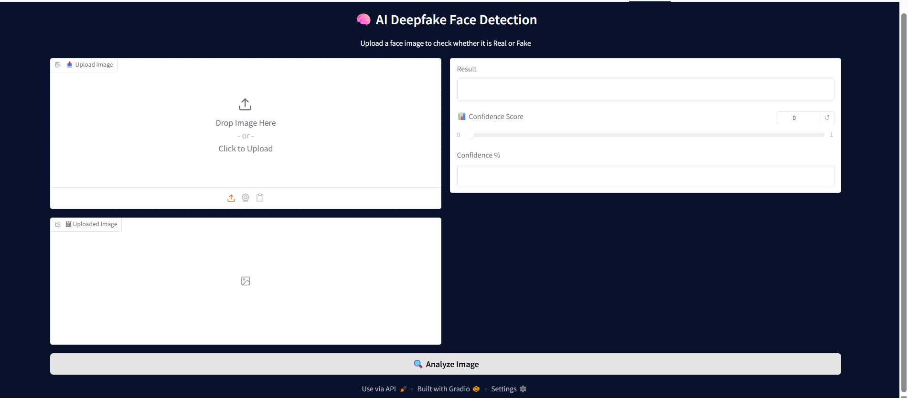
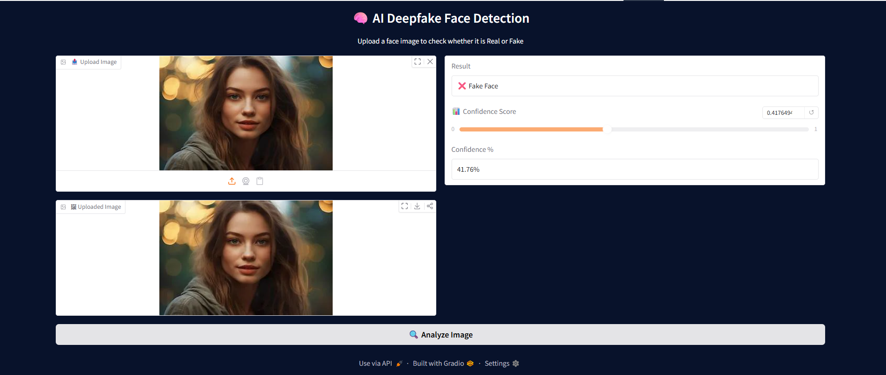
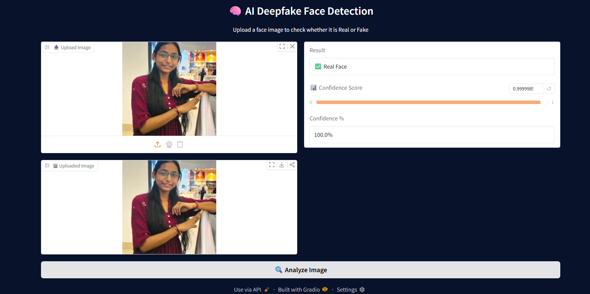

# Deepfake Face Detection using Deep Learning

## 📌 Project Overview
This project detects whether a facial image is **Real** or **Fake (Deepfake)** using a deep learning model built with TensorFlow and MobileNetV2.

The application provides a simple and interactive web interface where users can upload an image and instantly receive a prediction with a confidence score.

The model uses **Transfer Learning** with MobileNetV2 for efficient and accurate image classification.

---

## 🚀 Features
- Upload facial images for prediction
- Detect Real vs Fake (Deepfake) faces
- Confidence score for predictions
- Streamlit-based interactive web application
- Lightweight and fast deep learning model
- Hugging Face deployment support

---

## 🧠 Technologies Used
- Python
- TensorFlow / Keras
- MobileNetV2
- Streamlit
- NumPy
- OpenCV
- Pillow

---

## ▶️ Run the Application

Clone the repository:

```bash
git clone https://github.com/ssdivya08/deepfake-detection-system.git

Install dependencies:

pip install -r requirements.txt

Run the Streamlit app:

streamlit run main.py

Open in browser:

http://localhost:8501
```

🧪 How It Works

User uploads a facial image

The image is resized and preprocessed

The trained deep learning model analyzes the image

The system predicts whether the face is Real or Fake

Prediction result and confidence score are displayed

📊 Model Details

Model: MobileNetV2 (Transfer Learning)

Framework: TensorFlow / Keras

Image Size: 160 × 160

Loss Function: Binary Crossentropy

Output Classes:

Real Face

Fake Face

📷 Example Output

Prediction: Real Face

Confidence: 92%

## 📷 Screenshots

### Main Interface


### Fake Face Detection


### Real Face Detection



🌐 Deployment

Hugging Face Deployment:

https://huggingface.co/spaces/ssaidivya/deepfake-detector

🔮 Future Improvements

Add face detection before prediction

Improve accuracy using larger datasets

Support video deepfake detection

Cloud deployment and scalability improvements

Add explainable AI visualizations

📜 License

This project is developed for educational and research purposes.
